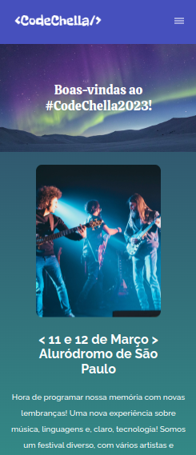
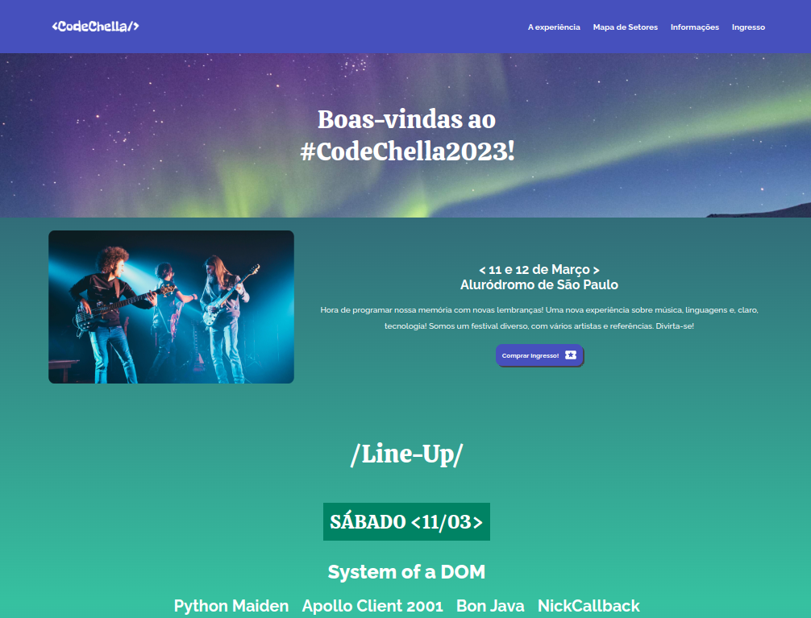

# AluraChallenge Front-End (6° edição) - CodeChella

O projeto <strong>CodeChella</strong> consiste em uma simulação de uma página web que apresenta informações sobre um evento musical. A página inclui uma funcionalidade que permite aos usuários preencher um formulário para gerar um ingressocom algumas informações, como: nome, tipo de ingresso, setor, data, e local, dinamicamente, que pode ser visualizado em outra página, depois de enviar o fórmulário com as informações. 

Resumindo, o projeto é uma página de evento que destaca a capacidade de gerar ingressos dinamicamente.

---
| :placard:  Vitrine.Dev |     |
| -------------  | --- |
| :sparkles: Nome        | **CodeChella**
| :label: Tecnologias | HTML, CSS, JavaScript
| :rocket: URL         | https://gabrielfelipeee.github.io/aluraChallenge_CodeChella/
| :fire: Desafio     | aluraChallenge Front-End (6° edição)
---

Tecnologias utilizadas:

    
    
    

 

## :thinking: Sobre o Desafio

O projeto proposto pela Alura, consiste em um desafio que busca simular um ambiente de trabalho real. A equipe da Alura nos forneceu um design já elaborado no FIGMA, além de um controle no TRELLO para gerenciar o projeto.

Durante as 4 semanas de duração do desafio, os instrutores estão disponíveis para nos fornecer dicas e orientações sobre como realizar as atividades propostas de maneira mais eficiente. Eles também recomendam um plano de estudos que podemos seguir para nos prepararmos adequadamente para os desafios que serão apresentados.

Participando desse projeto, pode-se vivenciar de forma prática as etapas de um projeto de desenvolvimento de software, desde a elaboração do design até a implementação das funcionalidades.

 

## :mag: Preview do projeto:

<h4 align="center">Mobile<h4>
    

 

<h4 align="center">Tablet<h4>

    

 

<h4 align="center">Desktop<h4>

    

:coffee: Desenvolvido por <a href="https://github.com/gabrielfelipeee" target="_blank">Gabriel Felipe</a>!
